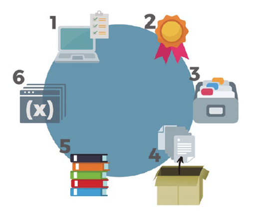
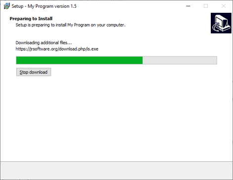
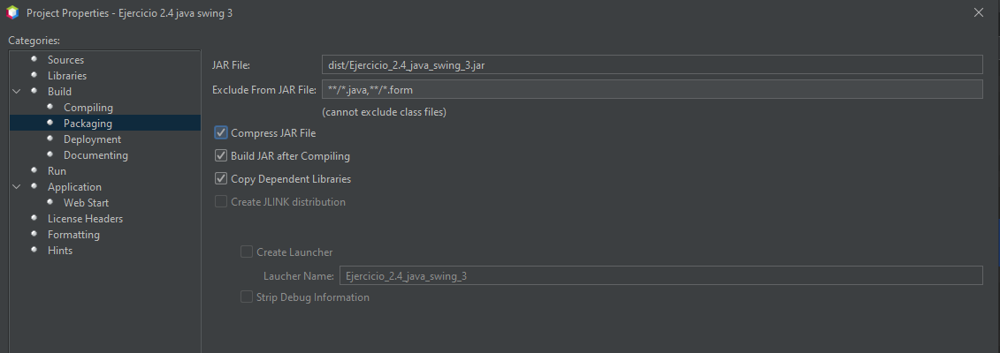

# UT3.2 - Empaquetado y despliegue de aplicaciones

## Introducción
Tras implementar una aplicación llega el momento de su distribución, para ello será necesario realizar un proceso de instalación que requiere de un paso previo: el empaquetado . Para realizar un correcto empaquetado se deben agrupar todos los
componentes necesarios para el despliegue de una aplicación.

Un paquete contiene no solo el código que implementa una aplicación, sino que constará de todo lo necesario para **desplegar** una aplicación y realizar una correcta
distribución. Los componentes principales son:
- Las librerías y bibliotecas.
- Los ficheros ejecutables.
- Los elementos multimedia.

El uso de las **librerías** permite reutilizar código y proporcionan un mayor número de funcionalidades que permiten disminuir la cantidad de tiempo invertido a la hora de
desarrollar. No obstante, son habitual fuente de problemas.

## Empaquetado

El empaquetado de una aplicación es el proceso de agrupar todos los archivos necesarios para su ejecución en un formato organizado y distribuible.Su objetivo es
facilitar la instalación, actualización o publicación del software en los equipos o dispositivos de los usuarios finales.

| **Elemento**                 | **Descripción**                                                     | **Ejemplo**                     |
|------------------------------|---------------------------------------------------------------------|---------------------------------|
| **Código ejecutable**        | Archivos binarios o bytecode de la aplicación.                      | `.exe`, `.jar`, `.apk`, `.ipa`  |
| **Bibliotecas y dependencias** | Librerías externas necesarias para el funcionamiento.              | `.dll`, `.so`, `.jar`           |
| **Recursos**                 | Imágenes, sonidos, hojas de estilo, bases de datos, etc.            | `resources/`, `img/`, `data/`   |
| **Ficheros de configuración**| Parámetros de instalación, propiedades o scripts.                   | `.xml`, `.ini`, `.cfg`, `.json` |
| **Documentación**            | Licencias, manuales o archivos README.                              | `README.txt`, `LICENSE`         |

### Herramientas de empaquetado habituales:

| **Entorno** | **Herramienta**                  | **Formato resultante**      |
|--------------|----------------------------------|-----------------------------|
| **Java**     | javac, jar, Maven, Gradle        | `.jar`, `.war`, `.ear`      |
| **.NET**     | Visual Studio                    | `.exe`, `.msi`              |
| **Python**   | setuptools, pyinstaller          | `.whl`, `.exe`              |
| **Linux**    | dpkg, rpmbuild, tar              | `.deb`, `.rpm`, `.tar.gz`   |
| **Android**  | Android Studio (Gradle)          | `.apk`, `.aab`              |
| **iOS**      | Xcode                            | `.ipa`                      |


## Despliegue de aplicaciones

Para **desplegar** una aplicación software es necesario disponer de instaladores que lleven a cabo cada uno de los pasos necesarios del proceso de instalación. Este tipo de
programas realizan una serie de operaciones sobre los archivos contenidos en el paquete de distribución que permite la instalación de cualquier software de forma
automática.



### Tipos de despliegues

| **Tipo**                    | **Descripción**                                                                 | **Ejemplo**                    |
|------------------------------|---------------------------------------------------------------------------------|--------------------------------|
| **Mediante instaladores**    | El usuario o técnico instala la aplicación de forma guiada.                     | Instaladores `.exe`, `.msi`    |
| **Automatizado**             | Se ejecuta mediante scripts o herramientas de integración continua.             | Jenkins, GitHub Actions        |
| **Local**                    | Se instala en un único equipo.                                                  | `.jar` ejecutable en el PC     |
| **Remoto / en la nube**      | Se despliega en un servidor o infraestructura cloud.                            | AWS, Azure, Heroku             |
| **Contenerizado**            | Se empaqueta junto con su entorno.                                              | Docker, Podman                 |


### Instaladores en sistemas Windows

Dependiendo del sistema operativo en el que nos encontramos, la forma de empaquetar las aplicaciones puede cambiar. Normalmente en el caso de Windows los más utilizados son: *EXE* o *MSI*

- **EXE**. Este tipo de instaladores es uno de los más comunes entre los usuarios y se trata de un archivo binario ejecutable con un asistente incluído. El instalador suele
permitir seleccionar las rutas de instalación y marcar qué componentes de los incluidos en el paquete se desean instalar.
- **MSI**. Los paquetes MSI se definen como instaladores de Microsoft. Son paquetes de software que contienen la información necesaria para automatizar su instalación, minimizando la intervención del usuario (para instalaciones desantendidas).
- **AppX**. Sistema de empaquetado universal de la tienda de aplicaciones de la Microsoft Store. Usan tecnología de contenderes para su ejecución.

### Instaladores en sistemas Linux

El sistema operativo libre por excelencia permite empaquetar y distribuir aplicaciones con diferentes formatos. En Linux se utilizan algunos tipos de paquetes que requieren
de operaciones específicas a través de línea de comandos para su creación.
- **TAR**: paquetes sin compresión.
- **TGZ**: se trata de paquetes TAR con compresión a través de GUNZIP .
- **deb**: sistema de instalación mediante paquetería usado en aquellas distribuciones
que están basadas en Debian, como Ubuntu o Kubuntu.
- **RPM** : Redhat Package Manager (sistemas Red Hat)
- **Pacman** : el sistema de paquetería de Arch Linux.
- **ZYpp** : sistemas de paquetería basados en SUSE y OpenSUSE.
- **Snap** : sistema de paquetes universales compatibles con diversas distribuciones.
- **Flatpak** : otro sistema de paquetería universal soportado por numerosas distribuciones.

### Instaladores en Android/iOS

En los sistemas Operativos móviles se usan los siguientes sistemas:

- Los ficheros APK (Android Application Package ) son archivos ejecutables que contiene todos los datos que se necesitan para instalar y hacer funcionar una aplicación Android .
- Los ficheros IPA(iOS AppStore Package ) son el sistema de paquetería que se utiliza en los sistemas iOS de Apple.

### Asistentens de instalación

Para realizar la instalación de una aplicación, habitualmente se diseña una interfaz de usuario,también conocida como **asistente de instalación** , que permitirá escoger entre varias
opciones de instalación.

Este tipo de programas realizan una serie de operaciones sobre los archivos contenidos en el paquete de distribución que permiten la instalación de cualquier software de forma
automática como InstallShield , NullSoft Install System para asistentes generalistas o InnoSetup e Install4J específicos de Java.



- **Inno Setup** : Inno Setup es un popular generador de instaladores gratuito y de código abierto para Windows.
- **NSIS** (Nullsoft Scriptable Install System ): NSIS es otra herramienta gratuita y de código abierto que te permite crear instaladores para Windows.
- **InstallShield** : InstallShield es una herramienta comercial ampliamente utilizada para crear instaladores en Windows.
- **PackageMaker** (macOS): Si estás desarrollando aplicaciones para macOS, puedes utilizar la herramienta PackageMaker de Apple para crear paquetes de instalación.
- RPM (Linux): Si estás trabajando en aplicaciones para distribuciones de Linux que utilizan el sistema de gestión de paquetes RPM, puedes crear instaladores utilizando las herramientas RPM relacionadas, como rpmbuild .
- **Install4J** : Una herramienta de creación de instaladores específica para proyectos en Java y multiplataforma.

### Firma de aplicaciones

La firma de aplicaciones se refiere al proceso de agregar una firma digital a un archivo de software, como una aplicación o un programa, para verificar su autenticidad e integridad durante el proceso de despliegue.

La firma de aplicaciones cumple varios propósitos importantes:

- Autenticación: Permite a los usuarios y sistemas verificar que la aplicación proviene de una fuente confiable. Si la firma digital no se puede verificar, es posible que la
aplicación haya sido alterada o provenga de una fuente no confiable.
- Integridad: Garantiza que el archivo de la aplicación no ha sido modificado desde que fue firmado. Si alguien intenta alterar la aplicación, la firma digital se volverá inválida.
- Seguridad: Ayuda a prevenir la distribución de aplicaciones maliciosas, ya que los usuarios pueden confiar en que las aplicaciones son genuinas y sin malware.

## Empaquetado y despliegue Netbeans

### Variables de entorno Java


Después de compilar un programa en Java debemos comprobar que se ejecuta con la misma versión que se ha compilado en Apache Netbeans.

Para ello en el caso de SO **Windows**:
1. Abrir el menú Inicio > buscar *Editar las variables de entorno del sistema*.
2. Pulsar en *Variables de entorno*
3. En la sección Variables del sistema, hacer lo siguiente:
    - Crear (o edita) una variable llamada *JAVA_HOME* con el valor del jdkque utiliza tu programa: por ejemplo, C: \Program Files \Apache NetBeans 27 \jdk\
    - Edita la variable *PATH* y añadir al principio: %JAVA_HOME% \bin
Para SO **Linux**:
1. En una terminal editar el fichero `.bashrc` de tu carpeta home y añadir estas líneas:
        export JAVA_HOME=/ usr/lib/jvm/jdk -24
        export PATH=$JAVA_HOME/ bin:$PATHVariables de entorno Java

### Empaquetado en ANT

Para el empaquetado en Netbeans seleccionar en las propiedades del proyecto el apartado Build >Packaging y dejar marcado Compress JAR File.



### Empaquetado en Maven

Por defecto, Maven genera un `.jar` cuando se construye un proyecto con *Clean and Build Project* . El archivo `.jar` aparecerá en la ruta: `target/tu -proyecto -1.0-SNAPSHOT.jar`

Para crear un `jar` ejecutable hay que editar el `pom.xml` y usar *maven-jar-plugin*:

```xml
<build>
    <plugins>
        <plugin>
        <groupId>org.apache.maven.plugins </groupId>
        <artifactId>maven-jar-plugin </artifactId>
        <version>3.3.0 </version>
        <configuration>
            <archive>
            <manifest>
            <addClasspath>true </addClasspath>
            <mainClass>VistaControlador.GeneraNumeros </mainClass>
            </manifest>
            </archive>
        </configuration>
        </plugin>
    </plugins>
</build>
```

Si una aplicación Swing usa **librerías externas** (por ejemplo, mysql -connector , json-simple, etc.) el `.jar` generado por defecto no las incluirá.

Para que el `jar` contenga todas las **dependencias**, se debe usar *maven-assembly-plugin*:

```xml
<plugin>
    <groupId>org.apache.maven.plugins </groupId >
    <artifactId>maven-assembly-plugin </artifactId >
    <version>3.7.0 </version >
    <configuration>
        <archive>
        <manifest>
            <mainClass>VistaControlador.GeneraNumeros </mainClass >
        </manifest>
        </archive>
        <descriptorRefs>
            <descriptorRef>jar-with-dependencies </descriptorRef >
        </descriptorRefs>
    </configuration>
    <executions>
        <execution>
            <id> make-assembly </id>
            <phase>package </phase>
            <goals>
            <goal> single </goal>
            </goals>
        </execution>
    </executions>
</plugin>
```

